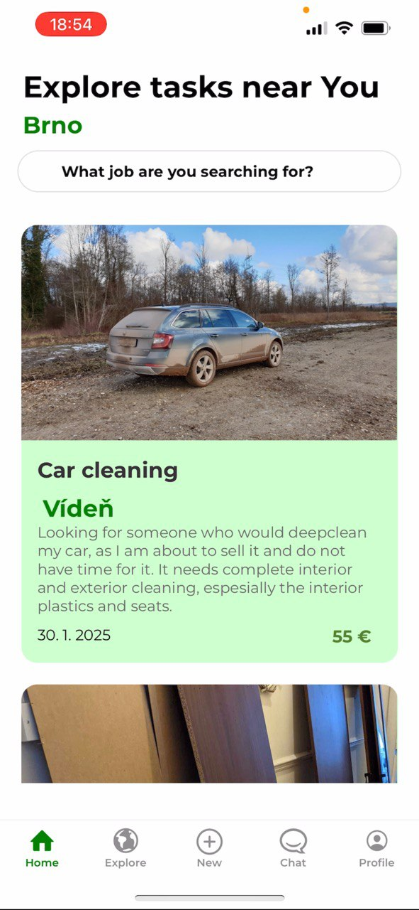

# TaskLink

**TaskLink** is a modern mobile application built with **React Native** and **Google Firebase/Firestore**, designed to help users find and offer services for various tasks seamlessly. The platform provides an intuitive interface where users can browse, filter, and connect with service providers or clients. TaskLink features an advanced search system, secure in-app chat, and real-time task management to streamline the process. Whether you need a quick fix at home or want to offer your professional skills, TaskLink makes the entire experience effortless and efficient.

## 📸 Screenshots
<p align="center">
  
  
  
  
  
  
</p>


## 🎥 Demonstration Video


## Features
- Advanced search with location, price, and rating filters
- Favorite services and providers
- In-app chat
- Income/expense tracking
- Task management


## Installation

1. Clone the repository:
   ```bash
   git clone ... 
    ```
2. Navigate to the project directory:
    ```bash
    cd taskLink
    ```
3. Install the dependencies:
    ```bash
    npm install
    ```
4. Run the app:
    ```bash
    npm start
    ```
5. Press `i` to run the app on the iOS simulator or `a` to run the app on the Android emulator. ( Or scan the QR code on your device using the Expo Go app.)
